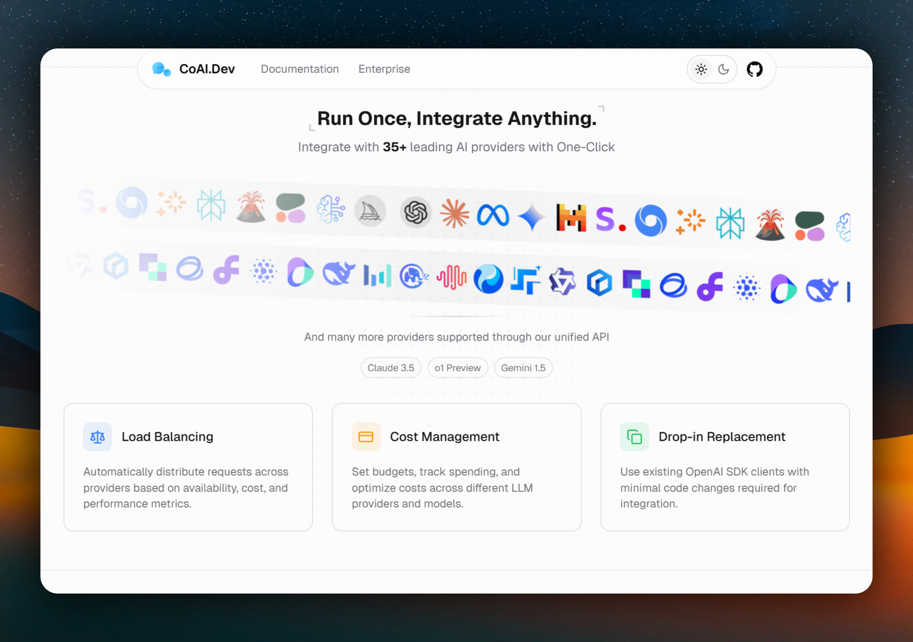

# UniAI

UniAI 是基于 CoAI 深度二次开发的全栈 AIGC 平台，定位为“可商用的多模型聚合 + 用户端聊天应用 + 管理后台 + OpenAI 兼容 API 网关”。



## 项目定位
- 面向站长和团队：统一管理多家模型供应商与计费策略。
- 面向终端用户：提供完整聊天、预设、翻译、分享、订阅等前台体验。
- 面向开发者：提供 OpenAI 兼容接口，便于已有客户端快速接入。

## 核心功能
- 多模型统一接入：OpenAI、Claude、Gemini、Midjourney、DeepSeek、Azure OpenAI 等。
- OpenAI 兼容中转：支持 `/v1/chat/completions`、`/v1/images/generations`、`/v1/models` 等。
- 渠道调度与负载：优先级、权重、失败重试、模型映射、分组可用性控制。
- 会话增强：会话分享、会话文件夹、拖拽排序、时间轴收藏（Starred Timeline）。
- 翻译工作台：独立 `/translate` 页面，支持模型翻译、历史记录、可配置系统提示词。
- Mini Apps 入口：`/apps` 聚合扩展工具入口。
- 管理后台：用户管理、渠道管理、订阅管理、公告广播、日志与分析仪表盘。
- 计费体系：点数计费 + 订阅计划并存。
- 文件解析能力：可对接 `blob-service` 处理 PDF/Office/图片/OCR/音频等。
- 多端支持：Web、PWA，保留 Tauri 桌面端工程。

## 相比原始 CoAI 的新增与差异（基于开发记录）
> 说明：以下内容根据仓库内 `dev-notes.md` 与 `development-log-2026-03-03.md` 汇总，聚焦本项目二开阶段的新增与重构能力。

| 能力维度 | CoAI 基线体验 | UniAI 新增/强化 |
|---|---|---|
| 首页样式与入口 | 以单一对话式首页为主 | 新增双首页模式：`chat`（底部输入）+ `default`（中置输入），并支持设置项 `homepage_mode` 持久化切换 |
| 预设（Mask）编辑器 | 预设编辑能力较轻量 | 重构为多 Tab 编辑器（模型设置 / 提示词 / 预设对话），支持温度、Top-P、Max Tokens、History、Stream 等参数覆盖 |
| 系统提示词链路 | 提示词与上下文同步关系弱 | `description` 与 `context[0].system` 双向同步，保证编辑器展示与真实发送上下文一致 |
| 预设头像能力 | 主要是 Emoji 头像 | 新增预设头像图片上传 + 1:1 圆形裁剪（`512x512`），并让 `Emoji` 组件兼容 URL/attachment/blob/data URI |
| 会话组织能力 | 基础会话列表管理 | 新增“时间轴导航 + 收藏消息 + j/k 键盘跳转 + 右侧浮动面板”能力 |
| 文件夹体系 | 文件夹交互与操作深度有限 | 新增完整文件夹 API + 前端树形管理，支持创建/重命名/删除/改色/拖拽移入移出/排序修复/高亮反馈/状态持久化 |
| 预设与文件夹联动 | 预设与会话归档关联较弱 | 新增 Preset-as-Folder：点击“使用预设”自动创建或复用同名文件夹，并在会话升级后自动落库归档 |
| 追问建议能力 | 无独立异步追问链路 | 新增 Follow-up Questions：主回复后异步生成追问，通过 WebSocket 下发并注入对应消息卡片 |
| 自动标题稳定性 | 标题任务在多模型网关下存在边界问题 | 修复用户设置持久化、模型路由参数、Gemini 网关兼容、失败回退与“New Chat 闪回”问题，流程收敛为“首句截取 -> AI 标题” |
| 消息操作交互 | 操作入口位置与显隐策略偏传统 | 操作栏从头像区迁移到消息内容下方，支持“最新消息常显 + 历史悬停显隐 + 占位防跳动”，并区分用户/AI操作集合 |
| 工程稳定性 | 开发期存在部分控制台噪音与构建摩擦 | 清理 SW/Ref/KaTeX/订阅相关报错，增强 Vite 代理与 `.air.toml` 监听策略，补齐 TS 类型问题并完成 DnD 迁移（`react-beautiful-dnd` -> `dnd-kit`） |

### 近期重点改造清单（按功能组）
- 预设链路稳定性：修复 preflight 无限转圈、条目闪烁、emoji/名称丢失、刷新后状态恢复等问题，并新增 `clientKey` 与本地持久化恢复策略。
- 预设市场体验：所有预设卡片统一三点菜单能力，内置预设支持“复制并编辑”，自定义预设支持快速编辑与删除。
- 文件夹 UX 补全：展开折叠动效、拖拽悬停虚线高亮、非法操作抖动反馈、颜色选择器、重命名保存/取消按钮、操作 Toast、多语言文案补齐。
- 侧栏体验升级：历史分组（Today/Yesterday/7 days/30 days/月分组）、懒加载、折叠状态持久化、侧栏宽度拖拽、移动端边缘手势开关、快捷键增强。
- 前端工程与联调：修复 `globals.less` 处理问题、`bootstrap` 重复初始化、代理直连缺口、TS 配置引用问题与若干页面类型冲突。
- 后端兼容与容错：补齐用户设置落库路径、订阅分支返回、自动标题回退策略、接口返回空列表语义统一（`[]` 而非 `null`）。

## 技术栈
- 前端：React 18 + TypeScript + Vite + Redux Toolkit + Tailwind + Radix UI
- 后端：Go + Gin + MySQL + Redis
- 通信：REST + SSE + WebSocket

## 快速开始（本地开发）

### 1. 环境要求
- Go `1.20+`
- Node.js `18+`
- pnpm `8+`
- MySQL `5.7+`（或 8.x）
- Redis `6+`

### 2. 配置后端
在项目根目录准备配置文件：

```bash
cp config.example.yaml config.yaml
```

至少确认以下配置可连接：

```yaml
mysql:
  host: localhost
  port: 3306
  user: root
  password: your-password
  db: chatnio

redis:
  host: localhost
  port: 6379
```

开发模式推荐：

```yaml
serve_static: false
server:
  port: 8094
```

### 3. 启动后端

```bash
go mod tidy
go run .
```

或使用热更新：

```bash
air
```

### 4. 启动前端

```bash
cd app
pnpm install
pnpm dev
```

默认访问地址：
- 前端：`http://localhost:5173`
- 后端：`http://localhost:8094`

### 5. 默认管理员账号
当数据库为空时，系统会自动创建：
- 用户名：`root`
- 密码：`chatnio123456`

首次登录后请立即修改密码。

## 可选：启动 Blob Service（文件解析）

```bash
cd blob-service
pip install -r requirements.txt
uvicorn main:app --port 18432
```

然后在系统设置中把 Blob 地址配置为对应服务地址。

## Windows 一键开发脚本
仓库提供 `start-dev.bat`，会尝试：
- 启动 Docker 容器 `coai-dev-mysql`、`coai-dev-redis`
- 启动 Blob Service
- 启动后端 `air`
- 启动前端 `pnpm dev`

如果你本地容器名不同，请先修改脚本中的容器名。

## 生产部署

### 方式 A：源码编译（推荐二开项目）

```bash
# 构建前端
cd app
pnpm install
pnpm build

# 构建后端
cd ..
go build -o uniai

# 运行
./uniai
```

建议通过环境变量覆盖生产配置（如 `MYSQL_HOST`、`REDIS_HOST`、`SECRET`、`SERVE_STATIC`）。

### 方式 B：Docker Compose
仓库包含 `docker-compose.yaml` / `docker-compose.stable.yaml`，可快速拉起 MySQL、Redis 和镜像服务。

注意：Compose 默认镜像为上游 `programzmh/chatnio`，如果你要部署 UniAI 的最新二开代码，请改为你自己的镜像。

## API 前缀说明
后端会根据 `serve_static` 决定路由前缀：
- `serve_static: true`：接口前缀为 `/api`（例如 `/api/login`、`/api/v1/models`）
- `serve_static: false`：接口无 `/api` 前缀（例如 `/login`、`/v1/models`）

## 常用接口
- 认证：`POST /login`、`POST /register`、`GET /userinfo`
- 对话：`GET /chat`（WebSocket）
- OpenAI 兼容：`POST /v1/chat/completions`、`POST /v1/images/generations`、`GET /v1/models`
- 会话管理：`/conversation/list`、`/conversation/share`、`/conversation/folders`、`/conversation/move`
- 管理后台：`/admin/user/*`、`/admin/analytics/*`、`/admin/logger/*`

## 目录结构

```text
app/                  前端工程
adapter/              模型适配层
auth/                 鉴权与计费
channel/              渠道调度与路由策略
manager/              对话与模型业务入口
manager/conversation/ 会话、分享、收藏、文件夹
admin/                后台管理接口
addition/             扩展功能（搜索/生成等）
blob-service/         文件解析服务（可选）
config.example.yaml   配置模板
main.go               服务入口
```

## 二开建议
- 品牌改造：优先修改 `app/src/conf/env.ts` 中默认 `appName` 等站点配置。
- 新模型接入：在 `adapter/` 新增厂商适配并在路由/分发处注册。
- 计费策略改造：重点看 `auth/quota.go`、`manager/chat.go`。
- 前端功能扩展：重点看 `app/src/routes`、`app/src/components`、`app/src/store`。

## 致谢
- 上游项目：CoAI / ChatNio
- 开源协议：Apache-2.0

基于开源协议进行二次开发时，请保留必要的版权与协议声明。
